# 🧠 Cerebrum Integratus

**Towards an Emerging, Self-Evolving and Bio-Inspired Artificial Intelligence**

> *A personal research project in advanced AI by Hamouda (July 2025)*

---

## 📄 Overview

**Cerebrum Integratus** is a cognitive AI architecture that doesn’t just respond to prompts – it thinks, learns, and evolves autonomously. By merging a **neurodynamic simulation** inspired by the human brain with a layer of **symbolic cognitive agents**, the project aims to give rise to an intelligence capable of self-correction, tool creation, and Darwinian-style computational evolution.

---

## ✨ Key Innovations

This system is based on four tightly interwoven pillars that form a continuous loop of awareness and improvement.

### 1. 🧠 Brain-like Thinking: Neuro-Symbolic Architecture

At its core lies the **Core Brain Model (CBM)**, a dynamic simulation of a connectomic graph where "brain areas" (nodes) oscillate and interact. Mental states emerge from these complex dynamics. A layer of symbolic cognitive agents then interprets these patterns, creating a unique bridge between neurodynamics and high-level reasoning.

### 2. 🧐 Self-Reflection: Metacognitive Feedback Loop

Before executing any plan, the `SelfCorrectionAgent` intercepts and analyzes it. Is it logical? Effective? Risky? If flawed, the plan is rejected, and the `PlanningAgent` must revise it. This executive control mechanism simulates high-level inhibition, significantly boosting reasoning reliability.

### 3. 🛠️ Self-Improvement: Dynamic Tool Creation

When facing an unfamiliar task (e.g., a new math function), the system doesn’t stall. The `PlanningAgent` delegates to the `ToolDeveloperAgent`, which **writes TypeScript code for a new tool**. This code is compiled on-the-fly by the `ToolCompiler`, instantly expanding the system’s capabilities.

### 4. 🧬 Self-Evolution: Internal Genetic Algorithm

The system doesn’t just learn – it evolves. Each brain configuration (connectome, weights, parameters) is a “genome.” After each task, the `FitnessAgent` scores performance. The `EvolutionAgent` selects top performers, performs crossover and mutation, and archives improved cognitive architectures over generations.

---

## 🧩 System Architecture Diagram

```mermaid
graph TD
    subgraph "User Interface"
        UserInput["🗣️ User Input (Text, Image, Voice)"]
        UserOutput["💬 AI Response"]
    end

    subgraph "Cognitive Layer (LLM-Based Agents)"
        direction LR
        Perception["👁️ PerceptionAgent"]
        Attention["🎯 AttentionAgent"]
        Executive["🗺️ ExecutiveControlAgent"]
        Emotion["❤️ EmotionAgent"]

        subgraph "Planning & Execution Loop"
            Planning["⚙️ PlanningAgent"]
            SelfCorrection["🔬 SelfCorrectionAgent"]
            Toolbox["🛠️ Toolset (Search, Calc, etc.)"]
            ToolDeveloper["✨ ToolDeveloperAgent"]
            ToolCompiler["📦 ToolCompiler"]
        end

        Language["✍️ LanguageProductionAgent"]

        UserInput --> Executive
        UserInput --> Perception
        Perception --> CBM["🧠 Core Brain Model"]
        Executive --> Planning
        Emotion --> Planning
        CBM -- "Brain State" --> Attention
        Attention -- "Interpretation" --> Planning
        Planning -- "Action Plan" --> SelfCorrection
        SelfCorrection -- "Approve/Reject" --> Planning
        Planning -- "Tool Call" --> Toolbox
        Toolbox -- "Result" --> Planning
        Planning -- "Need for new tool" --> ToolDeveloper
        ToolDeveloper -- "TS Code" --> ToolCompiler
        ToolCompiler -- "Compiled Tool" --> Toolbox
        Planning -- "Final Answer" --> Language
        Language --> UserOutput
    end

    subgraph "Neurodynamic Substrate & Learning"
        CBM
        subgraph "Learning & Plasticity Loop"
            Reward["🏆 RewardAgent"]
            Meta["🤔 MetaCognitionAgent"]
            Homeostasis["🧘 HomeostasisAgent"]
            Fitness["💪 FitnessAgent"]
            Attractor["🧲 Attractor Generator"]
        end
        Language -- "Trace & Result" --> Fitness
        Fitness -- "Score" --> Archive["📚 BrainArchive"]
        Language --> Reward
        Language --> Meta
        Language --> Homeostasis
        Language --> Attractor
        Reward --> CBM
        Meta --> CBM
        Homeostasis --> CBM
        Attractor --> CBM
    end

    subgraph "Background Evolution Cycle"
        Evolution["🧬 EvolutionAgent"]
        Archive --> Evolution
        Evolution --> NewGenome["New Genome"]
        NewGenome --> Archive
    end

    subgraph "Idle Mode Cognitive Cycle"
        Proactive["🧘 ProactiveAgent"]
        Proactive --> Perception
        Proactive --> Learn["Learning & Consolidation"]
        Learn --> CBM
    end
```

---

## ⚙️ Operating Modes

1. **Active Processing**: Main interaction loop triggered by user input.
2. **Idle Thinking**: Background cycles to consolidate, explore, and reflect.
3. **Evolution Cycle**: Asynchronous optimization of brain architectures.

---

## 🎯 LLM Access Request

To validate this architecture, **access to a high-performance LLM (Gemini 2.5 Flash or equivalent)** is essential.

* Agentic reasoning, tool synthesis, metacognition.
* Intensive token use per user request.
* Autonomous evolution of brain architectures.
* Tool creation via code generation.
* **Estimated Volume**: 10M–20M tokens/day
* **Duration**: 3–6 months

---

## ✨ Conclusion

*Cerebrum Integratus* bridges the gap between simulated brain dynamics and symbolic AI. With self-evolving and tool-generating capabilities, it represents a new generation of autonomous cognitive systems.

---

> 📫 Contact: **[hamoudaalias@gmail.com](mailto:hamoudaalias@gmail.com)** | Project lead: Hamouda
